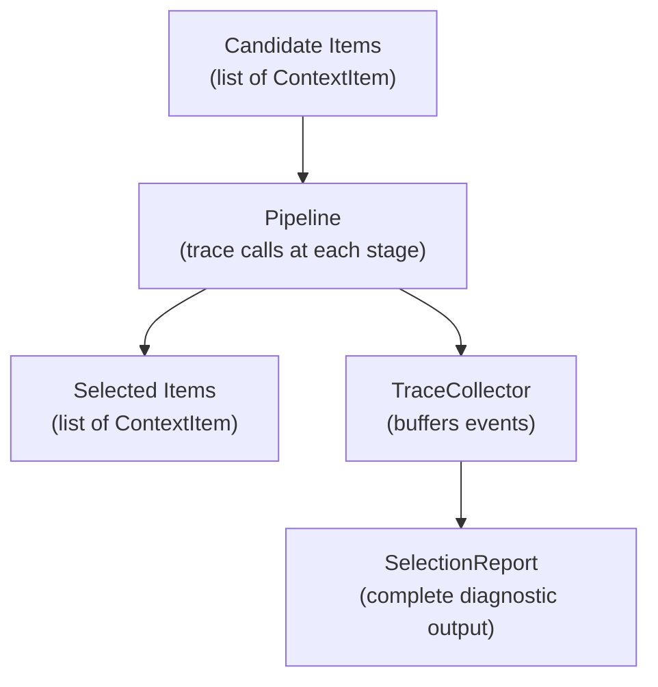

# Diagnostics

The diagnostics system exposes pipeline selection decisions as structured, inspectable data without affecting output or performance when disabled.

## Overview

Diagnostics answer the question: "why was this item included or excluded?" The pipeline instruments each stage with trace calls that record durations, item counts, and per-item decisions. When diagnostics are disabled, these calls are zero-cost. When enabled, the accumulated events form a `SelectionReport` that callers can inspect after the pipeline run completes.

## Ownership Model

The trace collector is passed at call time, not stored on the pipeline. One collector instance is used per pipeline execution.

This makes diagnostics per-invocation: each pipeline run receives a clean diagnostic context, and different concurrent runs can use different diagnostic configurations.

**Rationale:** Per-invocation ownership avoids thread-safety concerns and ensures each pipeline run gets an isolated diagnostic context.

**Rejected alternative:** Storing the collector on the pipeline object — this couples the collector lifecycle to the pipeline instance, prevents concurrent runs with different diagnostic configurations, and turns a per-call concern into a per-instance configuration.

## Null-Path Guarantee

When diagnostics are disabled (via `NullTraceCollector`), no event objects are constructed and no performance overhead is incurred. Implementations achieve this by checking `is_enabled` before constructing event payloads.

**Rationale:** Diagnostic instrumentation must never regress pipeline performance for callers who do not need it. The `is_enabled` check is the single gate that eliminates all allocation and computation on the disabled path.

## Data Flow

## Summary

| Type | Role | Spec page |
|------|------|------------|
| `TraceCollector` | Observer contract for pipeline instrumentation | [TraceCollector](diagnostics/trace-collector.md) |
| `TraceEvent` | Structured record of a single pipeline observation | [Events](diagnostics/events.md) |
| `PipelineStage` | Enumeration of observable pipeline stages | [Events](diagnostics/events.md) |
| `OverflowEvent` | Record produced when budget overflow occurs under Proceed strategy | [Events](diagnostics/events.md) |
| `ExclusionReason` | Why an item was excluded from the context window | [Exclusion Reasons](diagnostics/exclusion-reasons.md) |
| `InclusionReason` | Why an item was included in the context window | [Exclusion Reasons](diagnostics/exclusion-reasons.md) |
| `SelectionReport` | Complete diagnostic output from a pipeline run | [SelectionReport](diagnostics/selection-report.md) |
