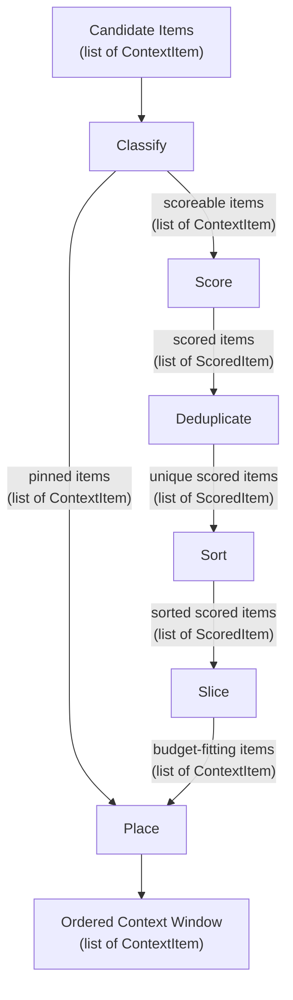

# Pipeline

The Cupel pipeline is a fixed 6-stage transformation that takes a set of candidate context items and a token budget, and produces an ordered list of selected items that fits within the budget.

## Invariants

1. **Fixed stage order.** The pipeline always executes stages in this order: Classify, Score, Deduplicate, Sort, Slice, Place. Stages cannot be reordered, skipped, or inserted between.

2. **Ordinal-only scoring.** Scorers assign relevance scores (rank). Slicers select items within budget (drop). Placers determine presentation order (position). Each concern is strictly separated — a scorer never drops items, a slicer never reorders, a placer never scores.

3. **Immutable items.** No stage modifies the ContextItem instances it receives. Stages produce new collections; they never mutate inputs.

## Data Flow

## Stage Summary

| # | Stage | Input | Output | Key Behavior |
|---|---|---|---|---|
| 1 | [Classify](pipeline/classify.md) | Candidate items | Pinned + Scoreable lists | Partition; exclude negative-token items |
| 2 | [Score](pipeline/score.md) | Scoreable items | Scored items | Invoke scorer; produce (item, score) pairs |
| 3 | [Deduplicate](pipeline/deduplicate.md) | Scored items | Unique scored items | Remove duplicate content (byte-exact) |
| 4 | [Sort](pipeline/sort.md) | Unique scored items | Sorted scored items | Stable sort by score descending |
| 5 | [Slice](pipeline/slice.md) | Sorted scored items | Budget-fitting items | Select items within effective token budget |
| 6 | [Place](pipeline/place.md) | Sliced + Pinned items | Ordered items | Merge, handle overflow, determine final order |

The pipeline operates on the principle of **ordinal-only scoring**: scorers assign relevance scores (rank), slicers select items within budget (drop), and placers determine presentation order (position). Each concern is strictly separated.

## Error Conditions

The pipeline may raise errors in two situations:

1. **Pinned items exceed available budget.** If the total tokens of pinned items exceeds `maxTokens - outputReserve`, the pipeline MUST raise an error during the Classify stage. This is not recoverable — the caller must reduce pinned items or increase the budget.

2. **Overflow after merge.** If the total tokens of merged items (pinned + sliced) exceeds `targetTokens`, the pipeline applies the configured [OverflowStrategy](data-model/enumerations.md#overflowstrategy). With the `Throw` strategy (default), this raises an error.
